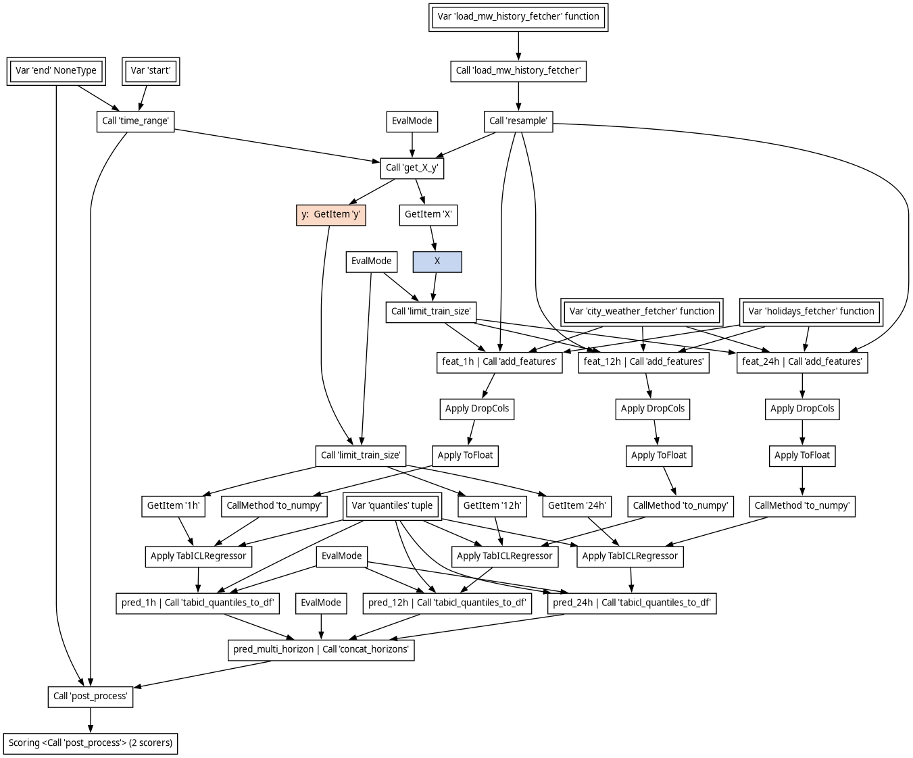

# Electricity load forecasting

This example is adapted from https://github.com/probabl-ai/forecasting.

The goal is to have a dataset and prediction pipeline that can be used to
experiment with features of skore and other packages.

## Contents

For simplicity, historical data is stored in the repo in `datasets`. Outputs can
be stored in `results` (ignored by git). `electricity_load_forecasting.py`
contains functions for loading data, defining the pipeline, cross-validation
splits etc. . `eda.py`, `cross_validate.py` and `search.py` are scripts that
perform basic exploratory data analysis, cross-validating the default pipeline,
running hyperparameter search & scoring the best model on a held-out set.

`requirements.txt` lists a few packages used in the scripts.

The current version of the pipeline looks like this:

See the report for an actual run [here](https://probabl-ai.github.io/skore-example-electricity-load/full_report/index.html)
